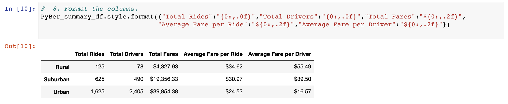
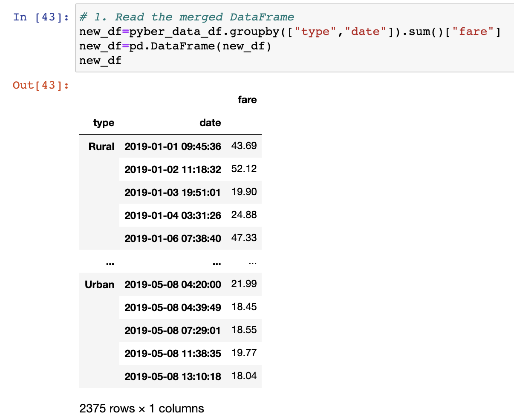
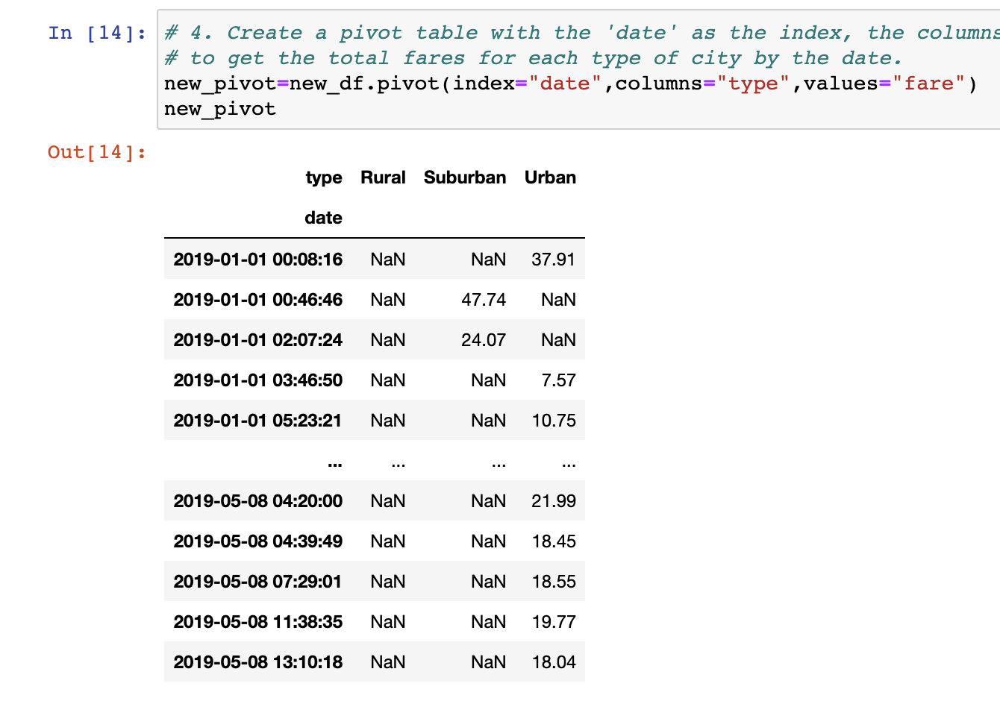
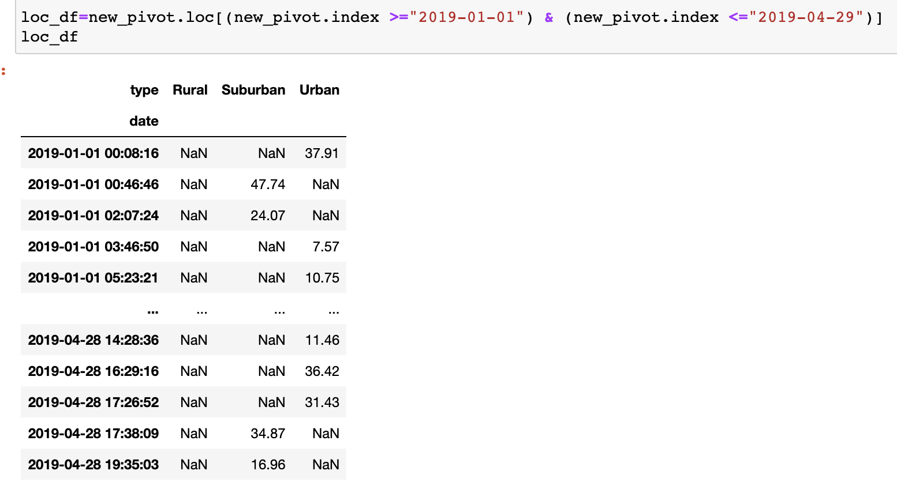
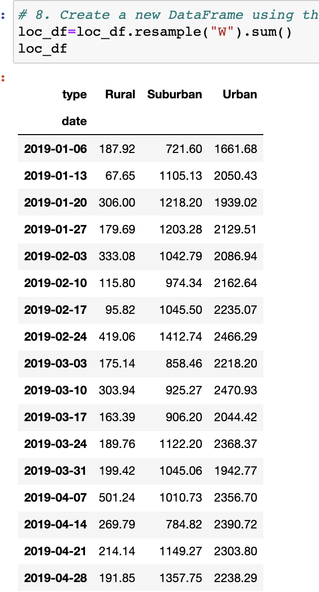
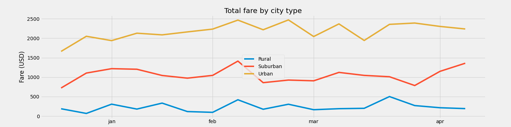

# Pyber Analysis
## Overview

Pyber is a ride-sharing service that operates in several districts in the US. The company has data on the fare ammount by city type (Rural, Suburban and Urban types) and wants it analyzed to review what business decisions must be made in function of the profit made.

## Results

Summary DataFrame shows the Total Rides, Total Drivers, Total Fares, Average Fare per Ride, Average Fare per Driver.

The next chart shows all rides grouped by their city type.

Pivot DataFrame shows the same information as the last DataFrame but pivoted around the date of the trip.

Loc DataFrame suses the information from the previous DataFrame but shows only the rides that occured between january and march 2019.

Resample DataFrame shows the same information as before but grouped around the weeks of the year.

Finally, PyBer_fare_summary shows the clear division between the different city types.  

## Summary

It is evident that the more populated an area, the bigger the fares en up being. Under this assumption 3 actions could be taken:

- Increase the fare on suburban and rural areas. This should increase out profit, although we run the risk of making our services inaccesible to the inhabitants of the area. It is also worth it to mention that individual rural fares are already the most expensive.
- Increase the number of drivers in rural areas. As previously mentioned the fares are already very high, so perhaps it is an issue of supply and we are not maxing out on our potential market reach.
- Increase the fare on urban areas. It is possible the demand is high enough that an increase such as this is well within the economic possibilities of urban users.
